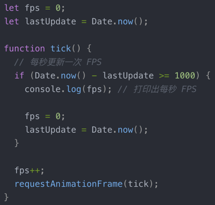
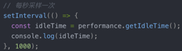
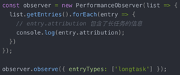
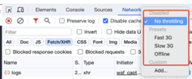
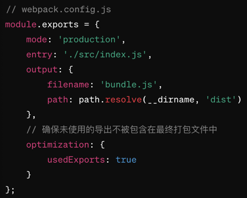
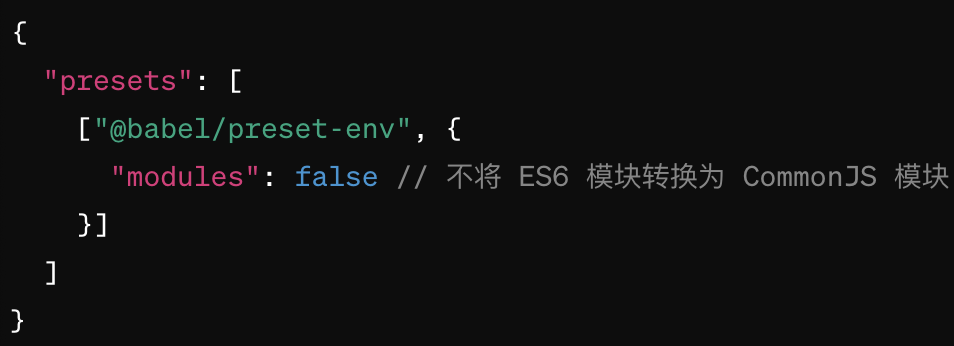
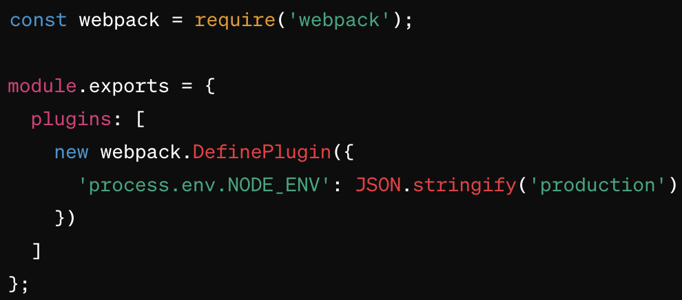

# 六、性能、网络、安全

## 1、性能优化

### （1）资源加载层面

1）减少HTTP请求数量

* 不常变动资源缓存（使用如Nginx、Varnish等缓存代理，减少请求打到服务器）
* 合理拆分打包代码（Code Splitting）
* 按需加载
* 图片懒加载
* 合理使用图片sprite（雪碧图）
* 使用HTTP 2多路复用

2）压缩资源体积

* 移除注释、调试信息、不必要的空格缩进等代码（可以启用Tree Shaking）
* 缩小变量名长度
* 图片压缩
* 图片转换格式
* 启用GZIP压缩

3）使用CDN加载静态资源

4）缓存静态资源

5）异步加载非关键资源（如广告脚本、分析工具），这样它们不会阻塞页面的初始渲染

6）后端提高资源响应速度

* 使用SSD固态硬盘代替传统硬盘，能显著提升服务器响应速度
* 数据库优化：合理设计数据库表结构，添加索引，优化查询语句，提升数据读取速度
* 后端代码减少不必要的计算和I/O操作

### （2）渲染层面

1）合理分页分块：一次只渲染一部分数据

2）懒加载（包括图片懒加载）：一开始只给个占位、只有目标在当前视窗可见时才去真正加载

3）Virtual DOM：对频繁更新的数据，使用虚拟DOM，减少因操作DOM导致的性能问题

4）对滚动、输入等高频事件进行防抖处理

5）vue-router路由缓存：使用keep-alive缓存组件，避免重复渲染，提升切换效率

6）动画优化

* 使用CSS动画而非JavaScript：CSS动画通常比JavaScript动画更高效，因为CSS动画可以由浏览器的合成线程（Compositor Thread）处理，而不需要通过JavaScript线程，这意味着即使JavaScript线程忙于其他计算，CSS动画仍然可以流畅运行；\
  注：CSS Transitions 和 CSS Animations是制作常见动画（如过渡和关键帧动画）的理想选择。
* 使用硬件加速：transform（如translate、scale、rotate）、opacity等某些CSS属性可以触发硬件加速，这意味着GPU（而非CPU）可以被用来处理动画，从而提升性能。例如，使用 transform: translateX(100px) 移动元素，而不是使用 margin-left 或 left。
* 避免重绘和重排：某些属性的变化会导致页面的重绘或重排\
  \- 重绘（repaint）：元素的外观被改变，但不影响布局，如color；\
  \- 重排（reflow）：元素的布局或几何结构被改变，如width、height、margin。\
  重排是一种高成本操作，因为它可能影响到DOM树中的多个元素。\
  所以：尽量使用transform和opacity属性来制作动画，避免布局属性的动画。
* 使用requestAnimationFrame：如果必须使用JavaScript来创建动画，应该使用requestAnimationFrame()而不是setTimeout或setInterval，因为requestAnimationFrame()会在每次浏览器绘制之前执行，这样可以保证动画的平滑性，并且可以在浏览器忙于其他事务时自动暂停，节省计算资源。
* 优化JavaScript动画的性能：当使用JavaScript动画库时，确保最小化动画中每帧的计算量、使用库的优化特性（如GSAP的will-change属性自动优化）。
* 控制动画的复杂度：复杂的动画可能需要消耗大量的CPU或GPU资源，优化动画的关键帧，避免使用高复杂度的动画路径，有时候简化动画效果或减少动画中的元素数量可以显著提升性能。
* 测试和监控：使用浏览器的开发者工具（如Chrome DevTools）中的Performance面板来监控动画的性能，检查动画是否触发了GPU加速，并确保动画流畅运行无卡顿。

7）SSR：提高首屏渲染速度

8）使用Web Worker进行需要前端长时间计算的任务，避免主线程（渲染等）被占用

### （3）工程化

1）监控性能

* 合成监控：Google Lighthouse
* 真实用户监控：记录真实的用户访问页面的数据，可以通过打点来收集数据，把采集到的数据上报到服务器，经过数据清洗、加工等工作后，在监控平台上呈现监控数据

1. 通过requestAnimationFrame进行FPS（每秒帧数）监控，当FPS出现大幅波动时可以探查原因\
   
2. 通过Performance API监控主线程空闲时间，可以观察主线程是否过于繁忙导致响应卡顿\
   
3. 通过监听长任务事件（PerformanceObserver）分析长任务，长任务会占用主线程时间片、导致干扰响应，常见长任务包括复杂计算、大数据量渲染等\
   
4. 模拟慢网络环境。使用模拟工具（如Chrome开发者工具 Network可以选择网络环境）模拟2G、3G等慢网络环境，观察应用性能是否存在问题\
   

2）负载测试，观察应用的承受能力上限

## 前端性能如何衡量

### （1）Google Web Vitals

Google的新一代Web性能体验和质量指标，其指标包括：

* LCP：Largest Contentful Paint，显示最大内容元素所需时间（衡量网站初次载入速度）；
* FID：First Input Delay，首次输入延迟时间（衡量网站互动顺畅程度）；
* CLS：Cumulative Layout Shift，累计布局位移（衡量网页元件视觉稳定性）；

除了以上三个主要衡量指标，还有：

* FCP：First Contentful Paint，首次内容绘制，标记浏览器渲染来自DOM第一位内容的时间点；
* TTFB：Time To First Byte，读取页面第一个字节的时间。

虽然LCP最大内容绘制是最重要的负载指标，但它也高度依赖于首次内容绘制（FCP）和首字节响应时间（TTFB），这些指标对监控和改进均具有非常重要的意义。

### （2）前端性能数据采集

1）有个[web-vitals库](https://github.com/GoogleChrome/web-vitals)提供了收集这些指标数据的方法&#x20;

2）performance API：W3C性能小组实现，提供多种api来获取一些性能数据，如window.performance.timing、performance.getEntries()、performance.getEntriesByType(type)、performance.getEntriesByName(name, type)、performance.now()、performance.mark()等&#x20;

3）js错误、vue错误、api错误采集  &#x20;

* js错误：通过window.onerror捕获 &#x20;
* vue错误：通过vue提供的Vue.config.errorHandler方法来捕获  &#x20;
* api错误：如果用axios来处理api，可以用catch 或 axios拦截器统一处理&#x20;

## 3、Tree Shaking

Tree Shaking是一种通过消除未使用的代码来优化项目包大小的技术。

### （1）选用支持tree shaking的打包工具

不同的打包工具启用tree shaking的方式：

| Webpack                                                                                                                                                 | Rollup                                     | Parcel                                        |
| ------------------------------------------------------------------------------------------------------------------------------------------------------- | ------------------------------------------ | --------------------------------------------- |
| 
1）使用ES2015模块语法（即import、export）

2）在webpack.config.js中配置生产环境，Webpack会在生产模式下自动启用tree shaking： 
 | Rollup天生支持ES6模块的导入和导出，并且默认就进行tree shaking。 | Parcel是一个零配置打包器，从Parcel 2开始，自动进行tree shaking。 |

### （2）配置Babel

确保Babel不转换ES6模块到CommonJS，因为这会阻止Webpack和其他打包工具进行tree shaking。在Babel配置文件（.babelrc 或 babel.config.js）中设置：

### （3）使用生产环境变量

在生产环境中构建应用时使用环境变量，特别是设置 NODE\_ENV 为 production，能启动更深层次的优化，因为：

1）环境特定的行为

许多JavaScript库和框架，包括React、Vue、Angular等，依赖于环境变量来确定它们应该如何运行。例如当NODE\_ENV设置为production时，React会禁用额外的开发时警告和性能调试工具，这些工具在开发环境中非常有用，但在生产环境中会增加不必要的负担。

2）代码优化和缩小

构建工具如Webpack和Rollup使用NODE\_ENV来决定是否启用某些代码优化策略，例如：

* Tree Shaking：移除未使用的代码；
* Minification（代码压缩）：通过删除不必要的字符（如空格和注释）和缩短变量名来减少代码体积；
* Dead Code Elimination（死代码消除）：移除代码中永远不会运行的部分。

3）安全性和稳定性

在生产环境中，应用需要运行得更加安全和稳定。环境变量可以帮助配置应用以隐藏敏感信息和错误详情，避免这些信息在用户端被暴露。例如，避免发送堆栈跟踪或数据库查询错误到前端。

4）性能优化

通过使用环境变量，可以配置应用只加载必要的功能和代码。在生产环境中，你可以禁用那些仅在开发阶段需要的特性，如详细的日志记录和热模块替换（HMR），从而优化性能。

5）第三方服务配置

环境变量允许开发者根据不同的运行环境配置第三方服务，例如数据库、API密钥或其他服务。这样确保应用在所有环境中都使用正确的服务设置，而不会意外地使用测试服务或配置在生产环境中。

【例子】在Webpack中，可以使用DefinePlugin来定义process.env.NODE\_ENV，Webpack会根据这个值来判断是否启用某些内置优化。按下图配置后，你的JavaScript代码可以通过检查 process.env.NODE\_ENV === production 来决定是否执行某些操作，而且构建工具也会据此优化输出的代码。

### （4）检查第三方库

一些第三方库可能不支持tree shaking，特别是那些不适用ES模块语法的库，查看库的文档了解是否支持tree shaking，或者考虑替代库。
