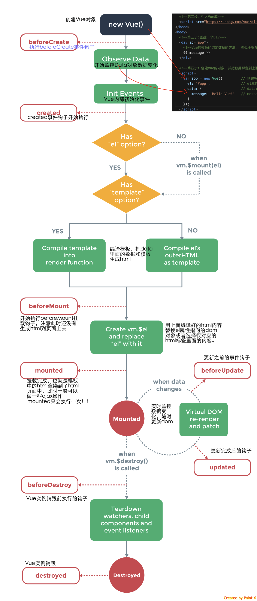
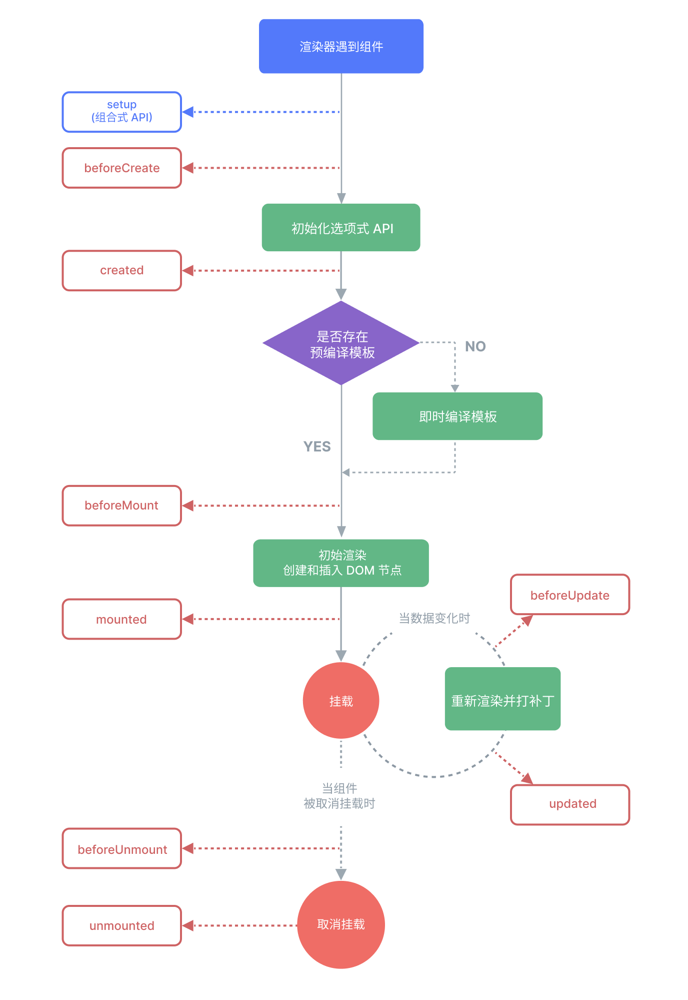

# 一、框架/库（Vue、React）

## 1、Vue生命周期、顺序、各生命周期做了什么？

所有生命周期钩子的this上下文将自动绑定至实例中，因此可以访问data、computed和methods。这意味着不应该使用箭头函数来定义一个生命周期方法，因为箭头函数绑定了父级上下文、而不是预期的组件实例。

### （1）Vue2

<figure><figcaption></figcaption></figure>

### （2）Vue3

<figure><figcaption></figcaption></figure>

### （3）详细介绍

<table data-full-width="true"><thead><tr><th width="110">生命周期</th><th>Vue2</th><th>Vue3 选项式API</th><th>Vue3 组合式API</th><th width="340">详细信息</th><th>服务端渲染时是否调用</th></tr></thead><tbody><tr><td>创建</td><td>beforeCreate</td><td>beforeCreate</td><td>setup</td><td><ul><li>setup()钩子是在组件中使用组合式API的入口，会在所有选项式API钩子之前调用；</li><li>beforeCreate: 组件实例初始化完成且props被解析后立即调用。</li></ul></td><td>是</td></tr><tr><td>创建</td><td>created</td><td>created</td><td>setup</td><td>created: 在组件实例处理完所有与状态有关的选项之后调用，响应式数据、计算属性、方法和侦听器已设置完成。</td><td>是</td></tr><tr><td>挂载</td><td>beforeMount</td><td>beforeMount</td><td>onBeforeMount</td><td>组件已完成响应式状态设置，但还没创建DOM节点，它即将首次执行DOM渲染过程。</td><td>否</td></tr><tr><td>挂载</td><td>mounted</td><td>mounted</td><td>onMounted</td><td>在组件被挂载（除异步组件或suspense树内组件外所有同步子组件均已挂载，自身DOM树已创建并插入父容器）之后调用。</td><td>否</td></tr><tr><td>更新</td><td>beforeUpdate</td><td>beforeUpdate</td><td>onBeforeUpdate</td><td>在组件即将因为一个响应状态变更而更新其DOM树之前调用，能访问到DOM变更之前的状态。</td><td>否</td></tr><tr><td>更新</td><td>updated</td><td>updated</td><td>onUpdated</td><td>在组件因为一个响应式状态变更而更新其DOM树之后调用。<br>注：在updated钩子中更改组件状态，会导致无限更新循环！</td><td>否</td></tr><tr><td>销毁</td><td>beforeDestroy</td><td>beforeUnmount</td><td>onBeforeUnmount</td><td>在一个组件实例被卸载之前调用，组件实例还保有全部功能。</td><td>否</td></tr><tr><td>销毁</td><td>destroyed</td><td>unmounted</td><td>onUnmounted</td><td>在一个组件实例被卸载（所有子组件均已卸载，所有响应式作用都已停止）之后调用，可以在这个钩子中手动清理一些副作用（如计时器、DOM事件监听器、与服务器的连接等）。</td><td>否</td></tr><tr><td>keep-alive</td><td>activated</td><td>activated</td><td>onActivated</td><td>被keep-alive缓存的组件被插入到DOM中时调用。</td><td>否</td></tr><tr><td>keep-alive</td><td>deactivated</td><td>deactivated</td><td>onDeactivated</td><td>被keep-alive缓存的组件从DOM中被移除时调用。</td><td>否</td></tr><tr><td>捕获错误</td><td>errorCaptured(Vue2.5.0+新增)</td><td>errorCaptured</td><td>onErrorCaptured</td><td>在捕获了后代组件传递的错误时调用。<br>默认错误向上传递、直到顶层应用级 app.config.errorHandler；errorCaptured钩子本身抛出的错误将和原来捕获到的错误一起发送到 app.config.errorHandler；可通过在钩子里返回false来阻止错误继续向上传递。</td><td>是</td></tr><tr><td>调式Dev only</td><td></td><td>renderTracked</td><td>onRenderTracked</td><td>注册一个调试钩子，当组件渲染过程中追踪到响应式依赖时调用。</td><td>否</td></tr><tr><td>调式Dev only</td><td></td><td>renderTriggered</td><td>onRenderTriggered</td><td>注册一个调试钩子，当响应式依赖的变更触发了组件渲染时调用。</td><td>否</td></tr><tr><td>SSR only</td><td></td><td>serverPrefetch</td><td>onServerPrefetch</td><td>注册一个异步函数，在组件实例在服务器上被渲染之前调用。</td><td>仅在服务端渲染中执行</td></tr></tbody></table>

## 2、父子组件生命周期顺序

## 3、Vue双向数据绑定原理

## 4、Vue2、Vue3实现响应式区别

## 5、Virtual DOM

### （1）Snabbdom

Snabbdom是一个高效的虚拟DOM库，以其简单和灵活的架构著称。核心库小巧、快速，同时提供了丰富的接口供开发者定制。Snabbdom可以与多种框架或纯JavaScript项目一起使用。它的核心特征包括：

1）模块化：它采用了模块化的设计，允许开发者通过引入不同的模块来扩展功能，如事件处理、样式处理等；

2）灵活性：允许开发者通过钩子（hooks）函数在节点的生命周期不同阶段执行自定义逻辑；

3）高效：通过对比新旧虚拟节点来计算最小的DOM更新操作，这种方法有效减少了不必要的DOM操作，提高了应用性能。

### （2）Vue的Virtual DOM

### （3）Vue的VirtualDOM的2个主要方法是什么？

### （4）React的Virtual DOM

React的虚拟DOM是React框架的核心特征之一，旨在提高应用的性能和效率。虚拟DOM是对真实DOM的一个轻量级的JavaScript对象表示。使用虚拟DOM，React能够最小化与真实DOM的交互次数，因为直接操作DOM通常是Web应用中性能瓶颈的主要原因之一。

工作原理：

#### 1）创建虚拟DOM树

当React组件渲染时，它会基于组件的状态（state）和属性（props）创建一个虚拟DOM树。

#### 2）比较虚拟DOM树（diff）

当组件状态或属性发生变化时，React会创建一个新的虚拟DOM树，然后比较新旧虚拟DOM树，以确定实际DOM需要做的最小更新。

我们知道DOM树是多叉树，比较两颗多叉树的算法（即找出两棵树的最小编辑距离并进行更新），这个算法被Pawlik and N.Augsten优化到O(n^3)（先找到两棵树的最小更新方式、两两比较就需要O(n^2)，找到差异后还要计算最小转换方式，所以是O(n^3)）。React团队优化了算法，只对比同层的节点，而不进行跨层对比，可以把时间复杂度优化到O(n)。

具体过程为进行树的深度优先遍历，同时给每个节点添加索引，便于最后渲染差异；一旦节点有子节点，就去判断子节点是否有不同。

【总结版】

* 只进行同级比较，当前节点发生改变，直接删除当前节点及其子节点；
* 对于没有设置key的节点只有增删改操作；
* 对于设置了key的节点，有增删移操作：\
  维护2个index（oldIndex和maxIndex），遍历到当前新节点，通过key找到其在旧列表中的index，即oldIndex，如果新节点index < oldIndex，则不移动，maxIndex设置为oldIndex；如果新节点index > oldIndex，将该旧节点移动到maxIndex的位置；遍历完一个列表节点后，继续遍历还没遍历完的列表，如果旧节点列表没遍历完，这些节点全都要删除，如果新节点列表没遍历完，这些节点全都要新增。
* 但对于只有文本的列表，不设置key的性能会更好，因为不设置key，就直接用innerText替换文本，而没有移动、增加、删除等对虚拟DOM的操作。

【细节版】diff过程细节为：

对DOM节点进行逐层比对，有3种情况：

* 没有新节点，什么都不做
* 新节点tagName或key与旧节点不同，则需要替换掉这个节点，不再继续遍历子元素，因为整个旧节点都被删掉了
* 新节点和旧节点的tagName和key都相同（可能新旧节点都没有key），那么开始遍历子节点，进行diffChildren 和 diffProps：
  * 判断两个列表的差异、进行listDiff，判断列表差异也分3步骤 【删、增、移】
    1. 遍历旧的节点列表，查看每个节点是否还存在新的节点列表中，以找到被删除的列表节点；
    2. 遍历新的节点列表，查看是否有新增的节点，以找到新增的列表节点；
    3. 在第2步的同时查看是否有节点被移动了，以找到被移动的节点（及其从哪移动到哪）
  * 给节点打上标记
  * 此时还需要判断是否有属性更新、进行diffProps，判断属性变更也分3步骤 【删、改、增】
    1. 遍历旧的属性列表，查看是否每个属性都出现在新属性列表中，以找到被删除的属性；
    2. 遍历新的属性列表，查看新旧属性列表都出现的属性是否有变化，以找到发生变化的属性；
    3. 第2步的同时查找旧属性列表中没有的属性，以找到新增的属性。

#### 3）更新真实DOM

最后渲染差异，拿着前面得到的两棵树的差异，去局部更新DOM。

* 深度遍历树，将需要做变更操作的节点取出来；
* 局部更新DOM（setAttribute、removeAttribute、node.remove()、node.insertBefore()等方法）。

### （5）Vue与React的Virtual DOM区别

### （6）Virtual DOM有什么作用？

Virtual DOM的6个作用：

1）提高性能：减少昂贵的直接DOM操作；

2）提高应用的响应性：

如数据频繁变化时，不需要频繁操作DOM，虚拟DOM可以通过**批量更新**和**异步渲染**来保持流畅的用户体验。如React通过其Fiber架构引入时间切片和优先级更新的概念，这允许框架在保持高性能的同时，还能执行低优先级的更新。

3）让开发者专注于数据和状态，而不是DOM；

4）组件的高度抽象化：

使得构建大型应用变得更加模块化和可维护。每个组件都有自己的状态和逻辑，可以独立更新，让开发和测试变得更加简单。

5）可以更好地实现SSR，同构渲染等；

6）跨平台能力：如React Native、Weex等。

## 6、React16

（1）React理念

React的理念是实现**快速响应**，快速响应的制约因素和解决办法有：

1. cpu瓶颈：时间分片，即将同步更新变为**可中断的异步更新**；
2. io瓶颈：尽量减少用户对网络延迟的感知（网络延迟本身是前端无法解决的），suspense功能及配套的hook useDeferredValue。

（2）React15被重构的原因：不能满足快速响应理念、不能支持异步更新。

具体地：

1. 递归更新子组件，中途无法中断；
2. 协调器（Reconciler）和渲染器（Renderer）交替工作（即协调器发现1个变化、渲染器更新1个变化，协调器再发现1个变化、渲染器再更新1个变化……），如果强行中断（这只是一种假设，实际上React15不能中断）、用户会看见更新不完全的DOM。

（3）React16（2017.9.26首发）架构：调度器（Scheduler） + 协调器（Reconciler） + 渲染器（Renderer）。

1. Scheduler：调度任务的优先级，高优先级任务优先进入Reconciler；
2. 在React16中，Reconciler 和 Renderer 不再交替工作，而是 Reconciler 将变化的虚拟DOM全部打上标记之后，再交给Renderer；
3. Scheduler 和 Reconciler 的工作可能被中断（原因1：有更高优先级任务；原因2：当前帧没有剩余时间了）。

（4）Fiber架构

双缓存（在内存中构建并直接替换）：current Fiber树 和 workInProgress Fiber树，他们通过 alternate 属性链接。

```javascript
currentFiber.alternate === workInProgressFiber;
workInProgressFiber.alternate === currentFiber;
```

## 7、Vue组件通信

1）props、$emit

2）ref

3）$parent 或 $root

4）provided 与 inject

5）attrs 与 listeners

6）Vue.observable

7）eventBus

8）Vuex

## 8、状态管理工具

### （1）从MVC讲起

M（Model）：业务数据，V（View）：用户界面，C（Controller）：控制器。

当项目越来越大、逻辑越来越复杂时，可能会出现多个View对应多个Model的情况，这就导致了数据流动方式的混乱。

以Backbone为例，由于Model对外直接暴露了set和on方法，导致View层可以随意改变Model中的值，也可以随意监听Model中值的变化。这样的设定最终会导致一个庞大的Model中的某个字段变化后，可能触发无数个change事件。在这些change事件的回调中，可能还有新的set方法调用，导致更多的change事件。更糟糕的是，一个Model还能改变另一个Model的值，整个数据流动的方式变得更加混乱，不可捉摸。

### （2）Flux

为了解决MVC的问题，Flux应运而生。

Flux是一套基于dispatcher的前端应用架构模式，其核心思想是**数据和逻辑永远单向流动**。

Dispatcher是Flux中的核心概念，它有2个API：1）register：用来注册一个监听器；2）dispatch：用来分发一个action。

所有请求和改变都只能通过action发出，统一由Dispatcher来分配。

Store负责保存数据，并定义修改数据的逻辑；它调用Dispatcher的register方法将自己注册为一个监听器，这样每当使用Dispatcher的dispatch方法分发一个action时，Store注册的监听器就会被调用。Store只对外暴露getter（读取器）而不暴露setter（设置器），这意味着在Store之外只能读取Store中的数据而不能进行任何修改。

对于View，如果界面操作需要修改数据，则必须使用Dispatcher分发一个action。

这样就保证了数据和逻辑的单向流动。各个角色之间不会像前端MVC那样存在交错的连线，Store中的数据的变化不再混乱：

&#x20;1）View可以保持高度简洁：它不需要关心太多的逻辑，只需要关心传入的数据；

2）控制了所有的数据，发生问题时可以方便排查：比起MVC架构下数据或逻辑的改动可能来自多个完全不同的源头，Flux架构追查问题的复杂度和困难度显然要小得多；

3）Flux把action做了统一归纳，提高了系统抽象程度：不论action是由用户触发的，从服务端发起的，还是应用本身的行为，对于我们而言，它都只是一个动作我而已；与MVC架构下不同的触发方式管理的混乱相比，Flux要优雅许多。

**Flux是一种架构思想，有很多对Flux思想的不同实现**，如Redux、MobX、Vuex等等。

### （3）Redux


### （4）MobX

### （5）Vuex

### （6）MobX、Redux、Vuex对比
